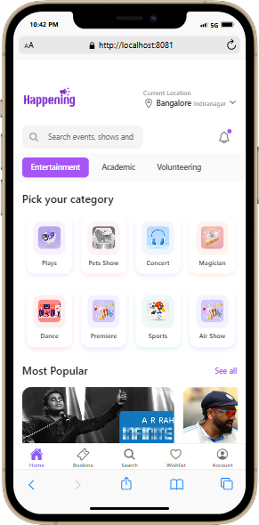

# Happening - Event Discovery & Booking App

please watch the introductory video here: 

https://www.loom.com/share/b1f80961eb75475d9f6db66a500edaae?sid=0a93e6d7-31ef-4bb1-9a18-bfd36ec46045

You can install the apk file from here:

[text](../../Downloads/application-a5f14aa4-ad01-4276-8076-c163f259c4ac.apk)

or from this link: 

https://expo.dev/accounts/musaid1234/projects/plurit-happening-app/builds/a5f14aa4-ad01-4276-8076-c163f259c4ac

Welcome to Happening, a modern cross-platform mobile application built with React Native and Expo. This app provides a seamless experience for discovering and booking events, with features like dark mode support, intuitive navigation, and a rich user interface.


## Features

### For Users
- Discover and book events across various categories
- Real-time ticket availability and booking
- Dark mode support for comfortable viewing
- Location-based event discovery
- User profiles with booking history
- Category-based navigation
- Secure payment integration
- Interactive event details with artist information

### Technical Features
- Cross-platform compatibility (iOS & Android)
- Responsive design that adapts to all screen sizes
- Smooth animations and transitions
- Efficient state management
- Optimized performance with lazy loading
- TypeScript for enhanced code reliability
- File-based routing with Expo Router

## Getting Started

### Prerequisites
Before you begin, ensure you have the following installed:
- Node.js (v16.0.0 or newer)
- npm (v8.0.0 or newer)
- Git

Check your installations:
```bash
node --version
npm --version
git --version
```

### Required Global Packages
Install these CLI tools globally:
```bash
# Install Expo CLI
npm install -g expo-cli 

# Install EAS CLI for building
npm install -g eas-cli
```

### Installation Steps

1. Clone the repository:
```bash
git clone https://github.com/usaidinfo/happening-app.git
cd happening-app
```

2. Install project dependencies:
```bash
npm install
```

3. Start the development server:
```bash
npx expo start
```

### Development Options
- Press `a` - Open in Android simulator
- Press `i` - Open in iOS simulator (macOS only)
- Press `w` - Open in web browser
- Scan QR code with Expo Go app (requires Expo account)

## Building the Application

### Setup
1. Login to your Expo account:
```bash
eas login
```

2. Configure your build:
```bash
eas build:configure
```

### Android Builds

For testing (APK):
```bash
eas build --platform android --profile preview
```

For Play Store submission (AAB):
```bash
eas build --platform android
```

### iOS Builds
```bash
eas build --platform ios
```
Note: iOS builds require an Apple Developer account ($99/year)

## Testing the Application

### Development Access
Use these credentials to test the app:
- Username: `Admin` (case sensitive)
- Password: `Admin` (case sensitive)

## Project Structure
```
happening-app/
├── app/                    
│   ├── (tabs)/            
│   │   ├── index.tsx      
│   │   ├── booking.tsx    
│   │   ├── search.tsx     
│   │   ├── wishlist.tsx   
│   │   └── account.tsx    
│   ├── auth/              # Authentication routes
│   │   ├── login.tsx
│   │   └── register.tsx
│   ├── booking/           # Booking routes
│   │   └── [id].tsx
│   ├── event/             
│   │   └── [id].tsx      
│   └── _layout.tsx        
├── components/            
│   ├── event/            
│   ├── home/             
│   └── overlays/         
├── assets/               
│   ├── images/
│   │   ├── categories/
│   │   ├── Most popular/
│   │   ├── Offer for you/
│   │   ├── resume booking/
│   │   ├── Seasonal events/
│   │   ├── Show/
│   │   └── Logo/
│   └── fonts/           
└── hooks/
```

## Tech Stack & Libraries

### Core Technologies
- React Native
- Expo SDK
- TypeScript
- Native Base UI Framework

### Key Dependencies
- expo-router: File-based routing
- @react-navigation/native: Navigation infrastructure
- Native Base: UI component library
- React Native Reanimated: Advanced animations
- Expo Vector Icons: Icon library
- @react-native-async-storage: Local storage

## Best Practices Implemented

### Code Quality
- TypeScript for type safety
- ESLint and Prettier for code consistency
- Component-based architecture
- Custom hooks for logic reuse

### Performance
- Lazy loading of images and components
- Optimized list rendering
- Efficient state management
- Minimal re-renders

### User Experience
- Smooth animations
- Intuitive navigation
- Error boundaries for graceful error handling
- Loading states and feedback
- Dark mode support

### Security
- Secure storage for sensitive data
- Input validation
- Safe navigation

## Screenshots

[Home Screen]

The home screen showcases featured events and categories.

[Event Details]
.png>)
Detailed view of an event with booking options.

[Dark Mode]
.png>)
The app supports a beautiful dark theme for comfortable viewing.

## Support

For support, email support@happening.com or join our Discord channel.

## Contributing

Contributions are welcome! Please read our contributing guidelines before submitting pull requests.

## License

This project is licensed under the MIT License - see the LICENSE file for details.

---

Built with ❤️ by the Happening Team

All the pictures of the app:

.png>)

-1.png>)

.png>)

.png>)

.png>)

.png>)

.png>)

.png>)

.png>)

-1.png>)

.png>)

.png>)

.png>)

.png>)


.png>)

the same readme.md file is posted on github repository